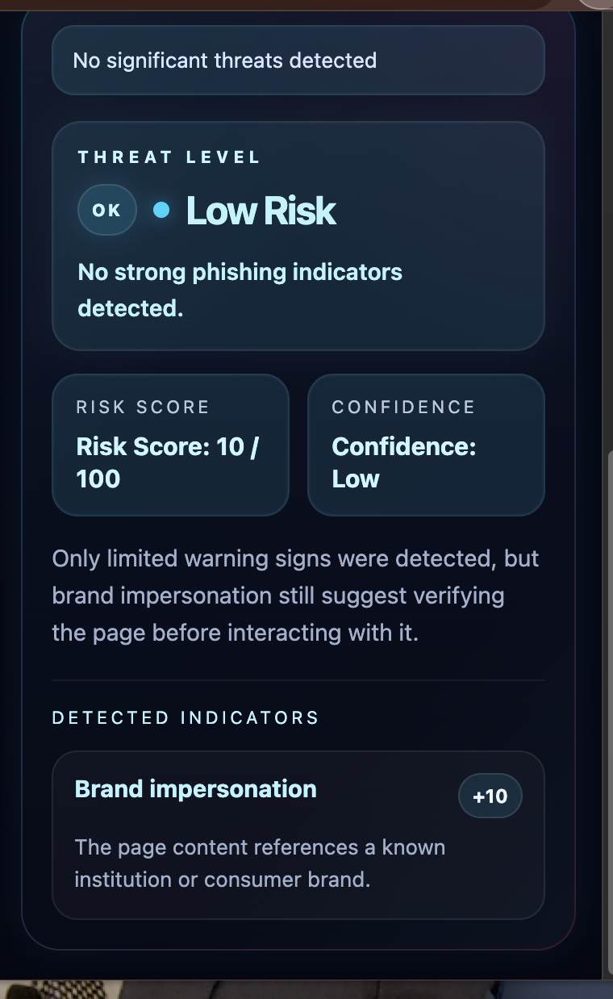
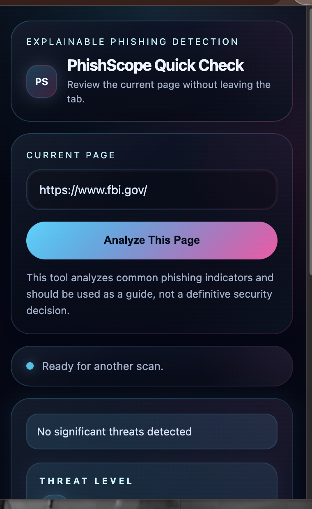

# PhishingScope 🔍

### Real-Time Phishing Detection for Everyday Browsing

PhishingScope is a Chrome extension that analyzes webpages in real time to detect phishing indicators and assign a clear, explainable risk score. It helps users make safer decisions by breaking down threats into simple, understandable insights.

---

## ✨ Features

- Real-time webpage analysis  
- Explainable risk scoring (0–100)  
- Threat level classification (Low / Medium / High)  
- Detection of phishing indicators:
  - Domain spoofing  
  - Brand impersonation  
  - Suspicious wording  
- Clean, modern cybersecurity-focused UI  

---

## 📸 Screenshots

### Extension Interface Preview

  
  

---

## 🚀 How It Works

PhishingScope scans the current webpage and evaluates it using rule-based detection logic. It looks for common phishing patterns such as impersonation, suspicious language, and misleading domains.  

A risk score is calculated and translated into a clear threat level, along with a plain-language explanation of the findings.

---

## 🛠 Tech Stack

- JavaScript  
- HTML / CSS  
- Chrome Extension APIs  

---

## ▶️ How to Run

1. Download or clone the repository  
2. Open Chrome → go to `chrome://extensions/`  
3. Enable **Developer Mode**  
4. Click **Load unpacked**  
5. Select the project folder  

---

## 👩‍💻 Author

Built by **Lilyan Hermes**
